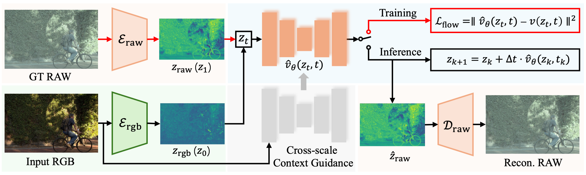

# [AAAI 2026 Oral] RAW-Flow: Advancing RGB-to-RAW Image Reconstruction with Deterministic Latent Flow Matching

<h4 align = "center">Zhen Liu<sup>1 *</sup>, Diedong Feng<sup>1 *</sup>, Hai Jiang<sup>2</sup>, Liaoyuan Zeng<sup>1</sup>, Hao Wang, Chaoyu Feng, Lei Lei, Bing Zeng<sup>1</sup>, Shuaicheng Liu<sup>1</sup></h4>

<h4 align = "center"> <sup>1</sup>University of Electronic Science and Technology of China</center></h4>
<h4 align = "center"> <sup>2</sup>Sichuan University</center></h4>

This is the official implementation of our AAAI2026 paper: RAW-Flow: Advancing RGB-to-RAW Image Reconstruction with Deterministic Latent Flow Matching. [Paper](https://arxiv.org/abs/2601.20364)

## Abstract

RGB-to-RAW reconstruction, or the reverse modeling of a camera Image Signal Processing (ISP) pipeline, aims to recover high-fidelity RAW data from RGB images. Despite notable progress, existing learning-based methods typically treat this task as a direct regression objective and struggle with detail inconsistency and color deviation, due to the ill-posed nature of inverse ISP and the inherent information loss in quantized RGB images. To address these limitations, we pioneer a generative perspective by reformulating RGB-to-RAW reconstruction as a deterministic latent transport problem and introduce a novel framework named RAW-Flow, which leverages flow matching to learn a deterministic vector field in latent space, to effectively bridge the gap between RGB and RAW representations and enable accurate reconstruction of structural details and color information. To further enhance latent transport, we introduce a cross-scale context guidance module that injects hierarchical RGB features into the flow estimation process. Moreover, we design a dual-domain latent autoencoder with a feature alignment constraint to support the proposed latent transport framework, which jointly encodes RGB and RAW inputs while promoting stable training and high-fidelity reconstruction. Extensive experiments demonstrate that RAW-Flow outperforms state-of-the-art approaches both quantitatively and visually.

## Pipeline

<div align="center">
  
</div>


## Installation

```bash
conda create -n rawflow python=3.11 -y
conda activate rawflow
pip install -r requirements.txt
```

If you prefer `venv`:

```bash
python3.11 -m venv .venv && source .venv/bin/activate
pip install -r requirements.txt
```

## Datasets

### MIT-Adobe FiveK

Download from [MIT-Adobe FiveK Dataset](https://data.csail.mit.edu/graphics/fivek). Unpack RAW files under `data/fivek_dataset/` such that the directory contains the per-camera folders expected by the preprocessing scripts.

```bash
# Training patches
python scripts/prepare_data.py --dataset fivek --split train

# Full-image evaluation set
python scripts/prepare_data.py --dataset fivek --split eval
```

The train/test split is determined by a fixed random seed (2817) inside the preprocessing script.

### PASCALRAW

Download from [PASCALRAW Dataset](https://purl.stanford.edu/hq050zr7488) and unpack under `data/PASCALRAW/`. Place the train/test image-id manifests as `<PASCALRAW_SPLITS>/train.txt` and `<PASCALRAW_SPLITS>/test.txt` (one image id per line) and point `--pascalraw-splits` at that directory:

```bash
python scripts/prepare_data.py --dataset pascalraw --split train \
    --pascalraw-splits data/PASCALRAW_splits
python scripts/prepare_data.py --dataset pascalraw --split eval \
    --pascalraw-splits data/PASCALRAW_splits
```

> Pass `--exiftool /path/to/exiftool` to either command if the binary is not on `PATH`. 

For convenience, we also provide a ready-to-use preprocessed FiveK NIKON_D700 dataset that can be used directly for training and evaluation. Download it from [Google Drive](https://drive.google.com/drive/folders/1JB9EA-GklPQg9j6Fzxib029hfQnjHTIp?usp=sharing).

## Pretrained Checkpoints

You can download our pre-trained weights from [Google Drive](https://drive.google.com/drive/folders/1pUWOdyogxZSumnRCv9HcffCR4sl4Ue60?usp=sharing).

| File                    | Camera       | Dataset   | Size    |
| ----------------------- | ------------ | --------- | ------- |
| `ckpt/nikon_d700.pth`   | NIKON_D700   | FiveK     | ~350 MB |
| `ckpt/canon_eos_5d.pth` | Canon_EOS_5D | FiveK     | ~350 MB |
| `ckpt/pascalraw.pth`    | PASCALRAW    | PASCALRAW | ~350 MB |

## Evaluation

 Taking `FiveK NIKON_D700` as an example:

```bash
python scripts/evaluate.py --config configs/eval/fivek_nikon.yaml
 # Outputs: test_output/rawflow_NIKON_D700/{metrics.json, visualization/}
```

## Training

 Taking `FiveK NIKON_D700` as an example:

```bash
# Stage 1 — RGB/RAW AE
python scripts/train_stage1_ae.py --config configs/stage1_ae/fivek_nikon.yaml

# Stage 2 — DLFM
python scripts/train_stage2_flow.py --config configs/stage2_flow/fivek_nikon.yaml

# Stage 3 — end-to-end fine-tuning
python scripts/train_stage3_finetune.py --config configs/stage3_finetune/fivek_nikon.yaml
```

## License

This project is released under the MIT license.

## Citation

If you find this repository helpful, please consider cite our paper:

```bibtex
@article{liu2026rawflow,
  title={RAW-Flow: Advancing RGB-to-RAW Image Reconstruction with Deterministic Latent Flow Matching},
  author={Liu, Zhen and Feng, Diedong and Jiang, Hai and Zeng, Liaoyuan and Wang, Hao and Feng, Chaoyu and Lei, Lei and Zeng, Bing and Liu, Shuaicheng},
  journal={arXiv preprint arXiv:2601.20364},
  year={2026}
}
```
